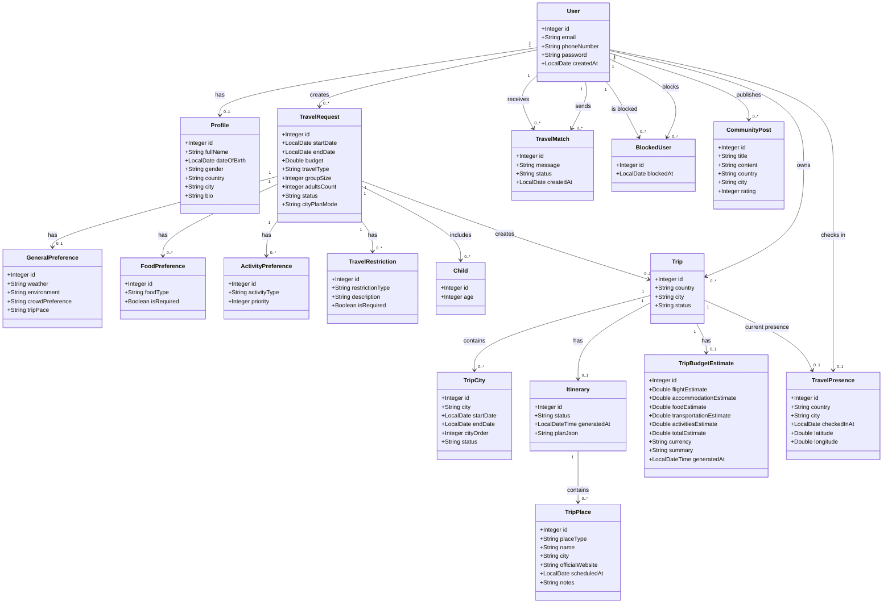
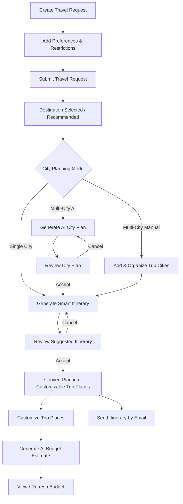

<div align="center">


# SahlDarbak | سهل دربك

### Plan Smarter, Travel Together ✈️

**SahlDarbak** is a smart travel-planning and traveler-matching web platform that helps travelers discover suitable destinations, build personalized trips, and explore their journey with greater confidence.

</div>

---

## Project Brief

**SahlDarbak** is a smart travel platform designed to support travelers before and during their trips.

The platform combines traveler preferences, trip details, artificial intelligence, and external travel data to create a more personalized travel-planning experience.

It helps travelers move from choosing a destination to planning cities and daily activities, preparing for the trip, and exploring their destination after arrival.

SahlDarbak is a **travel planning and assistance platform** and does not provide in-app booking or payment services.

---

## Problem

Planning a trip often requires travelers to use multiple platforms for different needs.

Travelers may need to search separately for destinations, weather, cities, accommodation, restaurants, activities, transportation, budgets, and travel experiences.

This can make travel planning:

- Time-consuming and fragmented.
- Difficult to personalize.
- Harder when planning multiple cities.
- Complicated when considering budget, preferences, or restrictions.
- Less convenient for travelers who want to explore or connect with others after arriving.

---

## Solution

SahlDarbak brings the main stages of the travel journey into one platform.

The system uses traveler preferences, trip information, AI, and external data to help users:

- Discover suitable destinations.
- Build personalized travel plans.
- Organize single-city or multi-city trips.
- Generate and customize daily itineraries.
- Estimate trip expenses and prepare for travel.
- Explore destination-related community experiences.
- Access a location-based city guide after arrival.
- Discover and connect with nearby travelers.
- Receive selected travel information through Email and WhatsApp.

The goal is to reduce the effort required to plan a trip while providing travelers with a more organized and personalized experience.

---

## Main Features

- AI-powered destination recommendations and comparisons.
- Personalized travel planning based on preferences, budget, and travel dates.
- Single-city and multi-city trip planning.
- Smart daily itinerary generation and trip customization.
- Trip budget estimation and travel preparation support.
- Community posts and destination-related travel experiences.
- Location-based city guide after arrival.
- Traveler matching, invitations, and chat.
- Email and WhatsApp support for selected travel information.

---

## Core User Flow


---

## Class Diagram

The following class diagram represents the **17 main entities** in SahlDarbak and their relationships.



# My Contribution — Trip Planning Flow

## Overview

My main responsibility in **SahlDarbak** was the **Trip Planning flow**.

My work focused on transforming the traveler's initial trip information and preferences into a structured and personalized travel plan.

The planning flow covers the journey from creating the travel request, collecting traveler preferences and restrictions, planning cities, generating a smart itinerary, allowing the traveler to review and customize the plan, and finally generating an estimated trip budget.

The general flow of my contribution is:



The goal of this flow is to allow AI to provide intelligent planning support while keeping the traveler in control of the final trip.

---

# Models & CRUD

I implemented the models and backend operations required to collect and manage the traveler's trip-planning information.

| Model | Responsibility |
|---|---|
| `TravelRequest` | Stores the main trip information including dates, budget, travel type, group/family information, status, and city planning mode. |
| `GeneralPreference` | Stores general preferences such as preferred weather, environment, crowd level, and trip pace. |
| `FoodPreference` | Stores the traveler's food preferences and whether they are required. |
| `ActivityPreference` | Stores preferred activities and their priority. |
| `TravelRestriction` | Stores travel restrictions such as allergy, accessibility, dietary, medical, or other restrictions. |
| `Child` | Stores child information for family trips. |
| `TripCity` | Represents cities included in a multi-city trip with their dates, order, and planning status. |
| `Itinerary` | Stores the generated itinerary, its status, generation time, and generated plan data. |

These models are connected to the main planning flow through their corresponding repositories, services, controllers, validations, and CRUD/business operations.

---

# Travel Request & Preferences

The planning process starts with a `TravelRequest`.

It contains the main information needed to understand the trip before generating any travel plan.

The request includes information such as:

- Travel start and end dates
- Budget
- Travel type
- Group size
- Number of adults
- City planning mode
- Request status

The traveler can then define additional preferences through:

- `GeneralPreference`
- `FoodPreference`
- `ActivityPreference`
- `TravelRestriction`
- `Child`

This allows the system to build a richer context before using AI for city planning, itinerary generation, or budget estimation.

---

# Travel Request Business Rules

A new travel request starts with the status:

```text
draft
```

The supported travel types are:

```text
solo
couple
group
family
```

Important business rules include:

- The trip end date must be after the start date.
- The budget must be greater than zero.
- A `group` trip requires a valid group size.
- A `family` trip requires the number of adults.
- A family trip must include at least one child before submission.
- Children must be between 0 and 17 years old.
- A general preference must exist before submitting the travel request.
- A travel request cannot be updated after a Trip has already been created from it.
- A travel request linked to a Trip cannot be deleted.
- After validating the required information, the request can be submitted and its status changes from `draft` to `open`.

---

# City Planning

SahlDarbak supports three city-planning modes:

```text
single_city
multi_city_manual
multi_city_ai
```

## Single-City Planning

For a single-city trip, the selected city can be used directly when generating the smart itinerary.

---

## Manual Multi-City Planning

The traveler can manually add and organize the cities that will be visited during the trip.

The backend validates the city plan to make sure that:

- The TravelRequest uses `multi_city_manual`.
- City dates remain within the overall travel dates.
- City date ranges do not overlap.
- The end date is not before the start date.
- Each city has a valid order.

This gives the traveler full control over the cities while still protecting the trip from invalid date combinations.

---

## AI Multi-City Planning

For trips using:

```text
multi_city_ai
```

the city plan is generated using AI.

The system sends the trip information and traveler preferences to the AI city planner.

Generated cities are initially stored with the status:

```text
suggested
```

The traveler can then review the complete city plan and either:

- Accept it.
- Cancel it and generate another plan.

Once the plan is accepted, the cities become part of the confirmed trip plan.

---

# AI Features

I implemented three AI-powered services using **Google Gemini**.

---

## 1. Smart City Planner

### `SmartCityPlannerAIService`

This service generates a multi-city plan for trips using AI city planning.

The AI receives trip context such as:

- Destination country
- Travel dates
- Trip duration
- Traveler preferences
- Travel style
- City planning requirements

It generates a structured city plan that distributes the available trip days between suitable cities.

The plan includes information such as:

- City
- City order
- Start date
- End date
- Reason for the city recommendation

The generated plan is saved as a suggested plan until the traveler accepts it.

---

## 2. Smart Itinerary Generator

### `SmartItineraryAIService`

This service generates a personalized daily itinerary for the trip.

Instead of depending only on AI-generated place names, the itinerary generation process retrieves real place information before sending the planning context to Gemini.

The AI receives:

- Trip destination
- Travel dates
- General preferences
- Food preferences
- Activity preferences
- Travel restrictions
- Trip pace
- Candidate hotels
- Candidate restaurants
- Candidate activities

The generated itinerary can include:

- Hotels
- Restaurants
- Activities
- Daily places
- Suggested times
- Recommendation reasons
- Official website information
- Available halal-related information

The AI organizes the available places into a daily plan that better matches the traveler's preferences and trip dates.

---

## 3. AI Trip Budget Estimate

### `TripBudgetEstimateAIService`

This service generates an estimated budget based on the actual trip context.

The estimate includes:

- Flight estimate
- Accommodation estimate
- Food estimate
- Transportation estimate
- Activities estimate
- Total estimate

The AI budget context can include:

- Departure country
- Departure city
- Destination
- Travel dates
- Number of trip days and nights
- Traveler's target budget
- Requested currency
- Travel type
- Group size
- Number of adults
- Children
- Traveler preferences
- Single-city or multi-city plan

For a multi-city trip, the budget calculation uses the accepted city plan.

The traveler can later refresh the estimate when a new calculation is needed.

---

# External APIs & Integrations

## Google Gemini

**Google Gemini** is the AI engine used in my planning flow.

I used Gemini for:

- Smart city planning
- Smart itinerary generation
- Trip budget estimation

The AI flow also supports generating content based on the selected Arabic or English application language where applicable.

---

## Geoapify

### `GeoapifyService`

I implemented and used `GeoapifyService` to retrieve real geographical and place information used during trip planning.

It is used for information such as:

- City coordinates
- Hotels
- Restaurants
- Activities
- Place identifiers
- Location-related information

This allows the itinerary-generation process to provide Gemini with real place candidates instead of relying only on generated place names.

---

## Tavily

### `TavilyService`

I implemented and used `TavilyService` to enrich the place information used during smart itinerary generation.

It is used for tasks such as:

- Retrieving additional hotel information
- Retrieving rating or pricing-related information when available
- Searching for halal-related evidence for restaurants

Halal-related information is used as supporting travel information and is not treated as an official halal certification.

---

## Brevo Email API

### `EmailService`

I implemented Email delivery using the **Brevo Email API**.

The generated itinerary can be sent to the traveler's Email.

The itinerary Email supports both:

```text
Arabic
English
```

based on the selected application language.

---

## WhatsApp Usage

One of my itinerary endpoints uses the project's existing WhatsApp integration to send the traveler's current daily plan.

My work includes retrieving the accepted `TripPlace` records for the current day and building the daily-plan message before passing it to the existing WhatsApp service.

> The WhatsApp integration itself was not implemented by me.

---

# Itinerary Lifecycle

The smart itinerary follows a controlled lifecycle.

```text
Generate
   ↓
Suggested
   ↓
Review
   ├── Cancel
   ↓
Accept
   ↓
Create TripPlace Records
   ↓
Customizable Trip Plan
```

When the itinerary is first generated, its status is:

```text
suggested
```

The traveler can review the suggested itinerary before accepting it.

If the itinerary is cancelled while still suggested, it is removed and another one can be generated.

When the itinerary is accepted:

- The generated plan is read.
- Planned places are converted into `TripPlace` records.
- Each place keeps its city and scheduled date.
- The itinerary status changes to `accepted`.
- The trip plan becomes customizable.

This separates the AI suggestion from the final user-controlled trip.

---

# Trip Customization

After the itinerary is accepted, the traveler is not limited to the original AI-generated plan.

The accepted trip can be customized through `TripPlace`.

The planning flow supports:

- Viewing all places belonging to the trip.
- Viewing places scheduled for a specific date.
- Viewing today's trip plan.
- Adding new places.
- Updating existing places.
- Removing places.

This allows the AI to create the initial structure while the traveler keeps control over the final itinerary.

---

# Budget Estimation Flow

The budget estimate is generated after the Trip exists.

The system gathers the trip context and sends it to the AI budget service.

The result is stored as the trip's current budget estimate.

The traveler can then:

```text
Generate Estimate
      ↓
View Estimate
      ↓
Refresh Estimate
```

This makes the estimate reusable instead of generating a new AI response every time the page is opened.

---

# Technologies Used in My Contribution

| Technology | Usage |
|---|---|
| **Java** | Main backend programming language |
| **Spring Boot** | Backend application framework |
| **Spring Web MVC** | REST controllers and HTTP APIs |
| **Spring Data JPA** | Repository and database access |
| **Hibernate** | ORM and entity relationships |
| **Jakarta Validation** | Model and request validation |
| **MySQL** | Relational database |
| **REST APIs** | Backend communication and external integrations |
| **Google Gemini** | AI city planning, itinerary generation, and budget estimation |
| **Geoapify API** | Places and location data |
| **Tavily API** | Additional travel/place information and halal-related evidence |
| **Brevo Email API** | Itinerary Email delivery |
| **Jackson / ObjectMapper** | AI JSON serialization and parsing |
| **Lombok** | Reducing Java boilerplate code |

---

# Extra Endpoints

In addition to the CRUD operations, I implemented the following business endpoints for the planning flow.

| # | Endpoint | Method | API | Description |
|---:|---|---|---|---|
| 1 | Generate Smart Itinerary | `POST` | `/api/v1/trip/generate-smart-itinerary/{tripId}?lang={lang}` | Generates a personalized AI-powered daily itinerary for the selected trip. |
| 2 | Generate City Plan | `POST` | `/api/v1/trip/generate-city-plan/{tripId}?lang={lang}` | Generates an AI-based multi-city plan and distributes the trip dates between suggested cities. |
| 3 | Get Trip by Travel Request | `GET` | `/api/v1/trip/get-by-travel-request/{travelRequestId}` | Retrieves the Trip linked to a specific TravelRequest. |
| 4 | Get Trip by ID | `GET` | `/api/v1/trip/get-by-id/{tripId}` | Retrieves a Trip using its ID. |
| 5 | Get Trip Places by Date | `GET` | `/api/v1/trip-place/get-by-date/{tripId}/{date}` | Retrieves all accepted trip places scheduled for a specific date. |
| 6 | Get Today's Plan | `GET` | `/api/v1/trip-place/today/{tripId}` | Retrieves the accepted trip places scheduled for the current date. |
| 7 | Get Trip Places by Trip | `GET` | `/api/v1/trip-place/get-by-trip/{tripId}` | Retrieves all customizable TripPlace records belonging to a trip. |
| 8 | Get Trip Cities | `GET` | `/api/v1/trip-city/get-by-trip/{tripId}` | Retrieves all cities included in a trip. |
| 9 | Accept City Plan | `POST` | `/api/v1/trip-city/accept-city-plan/{tripId}` | Accepts the AI-generated suggested city plan. |
| 10 | Cancel City Plan | `DELETE` | `/api/v1/trip-city/cancel-city-plan/{tripId}` | Cancels and removes the current suggested AI city plan. |
| 11 | Generate Budget Estimate | `POST` | `/api/v1/trip-budget-estimate/generate/{tripId}?lang={lang}` | Generates and stores an AI-powered budget estimate for the trip. |
| 12 | Get Budget Estimate | `GET` | `/api/v1/trip-budget-estimate/get-by-trip/{tripId}` | Retrieves the current budget estimate linked to a trip. |
| 13 | Refresh Budget Estimate | `PUT` | `/api/v1/trip-budget-estimate/refresh/{tripId}?lang={lang}` | Regenerates and updates an existing trip budget estimate. |
| 14 | Submit Travel Request | `PUT` | `/api/v1/travel-request/submit-travel-request/{travelRequestId}` | Validates the completed travel request and changes its status from draft to open. |
| 15 | Get Travel Requests by User | `GET` | `/api/v1/travel-request/get-by-user/{userId}` | Retrieves all travel requests belonging to a specific user. |
| 16 | Get Travel Request by ID | `GET` | `/api/v1/travel-request/get-by-id/{travelRequestId}` | Retrieves a specific TravelRequest using its ID. |
| 17 | Accept Itinerary | `POST` | `/api/v1/itinerary/accept/{tripId}` | Accepts a suggested itinerary and converts its planned places into customizable TripPlace records. |
| 18 | Cancel Itinerary | `DELETE` | `/api/v1/itinerary/cancel/{tripId}` | Cancels a suggested itinerary before it is accepted. |
| 19 | Get Itinerary by Trip | `GET` | `/api/v1/itinerary/get-by-trip/{tripId}` | Retrieves the generated itinerary and its current status for a trip. |
| 20 | Send Itinerary by Email | `POST` | `/api/v1/itinerary/send-email/{tripId}?lang={lang}` | Sends the generated itinerary to the traveler's Email using the selected language. |
| 21 | Send Today's Plan by WhatsApp | `POST` | `/api/v1/itinerary/send-today-whatsapp/{tripId}` | Builds today's plan from the accepted TripPlace records and sends it using the project's existing WhatsApp service. |

---

# Contribution Summary

My contribution focused on the **planning stage of SahlDarbak**.

I implemented the data models and business logic required to collect the traveler's trip information and preferences, validate and submit travel requests, plan cities manually or using AI, generate personalized itineraries using real place data, manage the itinerary lifecycle, customize accepted trip plans, estimate trip budgets, and send itinerary information by Email.

I also implemented the AI services used for:

- Multi-city planning
- Smart itinerary generation
- Trip budget estimation

and integrated the planning flow with:

- Gemini
- Geoapify
- Tavily
- Brevo Email API

The main idea behind my work was to make AI assist the traveler throughout the planning process without removing user control.

**AI creates the initial intelligent plan, while the traveler reviews, accepts, and customizes the final trip.**


---

## Team

| Team Member | Main Area |
|---|---|
| **Razan Almadan** | Discover |
| **Lama Alharbi** | Plan |
| **Mohammed Aljubaili** | Explore |

---

<div align="center">

### SahlDarbak | سهل دربك ✈️

**Plan Smarter, Travel Together**

</div>
